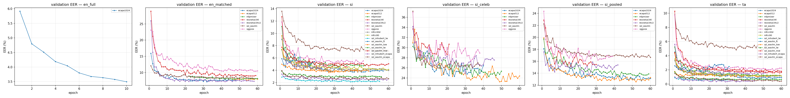
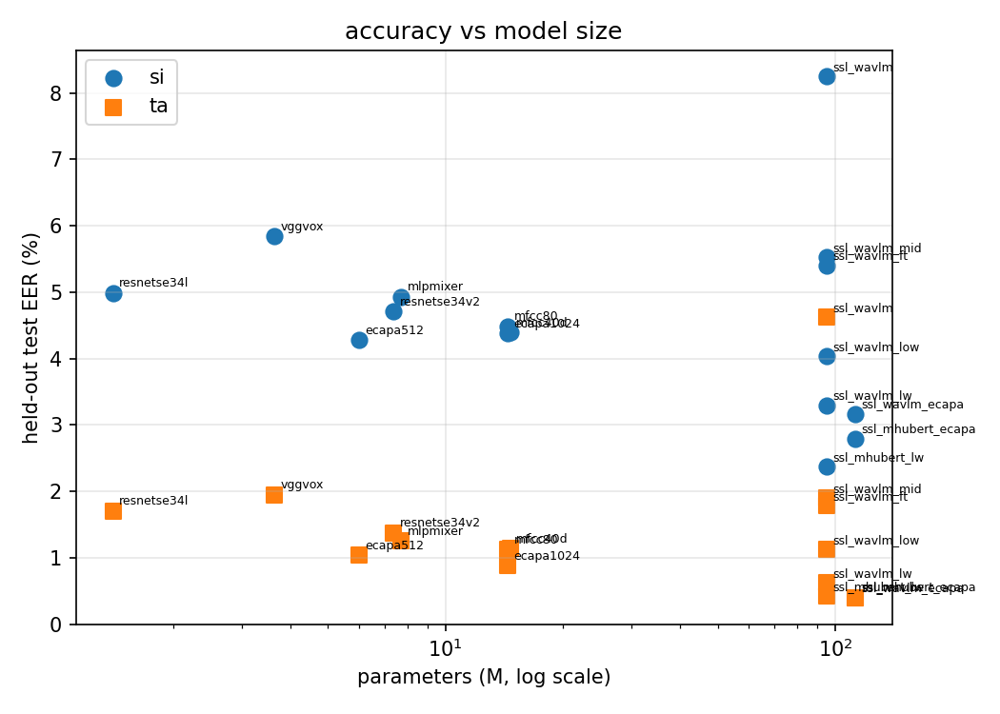
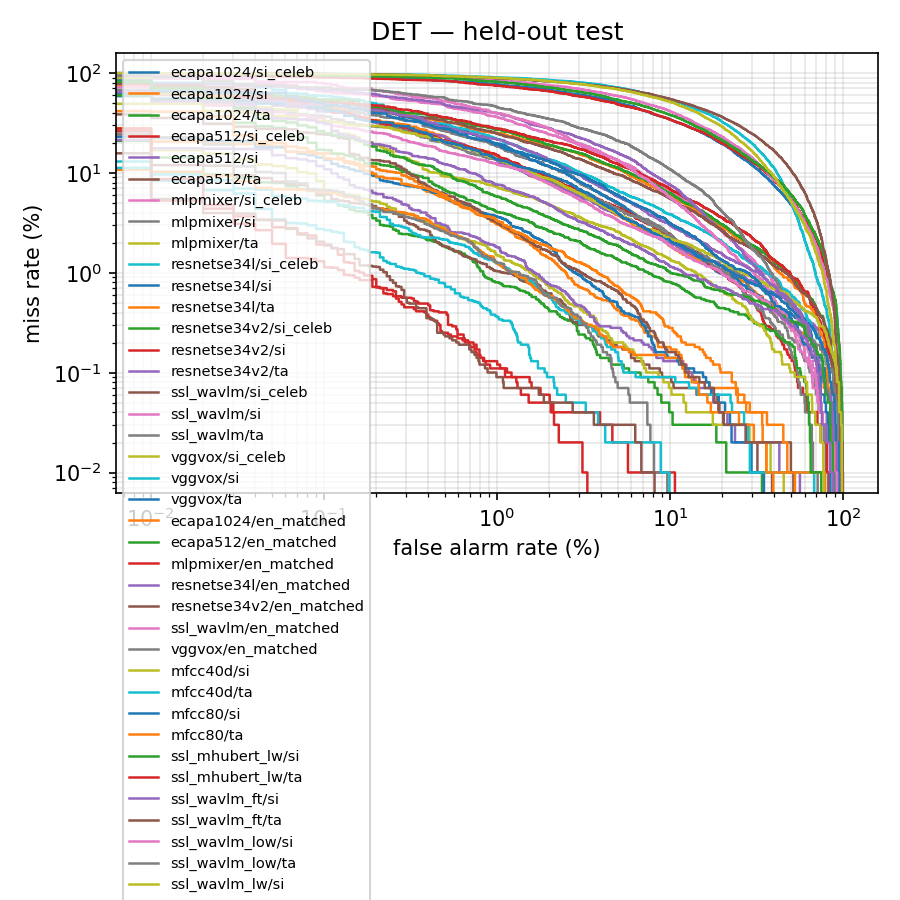

# Sinhala / Tamil speaker verification — experimental analysis

54 experiments; 46 with held-out test evaluation.

All splits are speaker-disjoint (`experiments/tools/build_splits.py`).
Model selection used validation trials only; the test set was scored once,
at the validation-selected checkpoint.

## 1. Headline results (held-out test set)

| arch | loss | cond | val EER % | test EER % | Δ val→test | test EER AS-Norm % | minDCF | d' | minCllr | params | GFLOPs/2s |
|---|---|---|---|---|---|---|---|---|---|---|---|
| resnetse34v2 | aamsoftmax | en_matched | 7.240 | 7.260 | 0.020 | 7.080 | 0.417 | 3.014 | 0.269 | 7373388 | 9.255 |
| ecapa1024 | aamsoftmax | en_matched | 7.180 | 7.580 | 0.400 | 7.470 | 0.411 | 2.986 | 0.276 | 14461056 | 5.167 |
| ssl_wavlm | aamsoftmax | en_matched | 8.220 | 7.880 | -0.340 | 7.260 | 0.580 | 2.900 | 0.286 | 94976240 | 22.096 |
| ecapa512 | aamsoftmax | en_matched | 7.720 | 7.960 | 0.240 | 7.680 | 0.435 | 2.941 | 0.286 | 5994688 | 1.927 |
| mlpmixer | aamsoftmax | en_matched | 8.000 | 8.250 | 0.250 | 8.020 | 0.448 | 2.878 | 0.299 | 7713024 | 3.031 |
| resnetse34l | aamsoftmax | en_matched | 8.800 | 8.760 | -0.040 | 8.130 | 0.564 | 2.812 | 0.308 | 1404054 | 1.788 |
| vggvox | aamsoftmax | en_matched | 10.440 | 10.420 | -0.020 | 9.760 | 0.632 | 2.667 | 0.355 | 3637952 | 1.060 |
| ssl_mhubert_lw | aamsoftmax | si | 2.141 | 2.369 | 0.228 | 2.178 | 0.156 | 4.427 | 0.098 | 94966029 | 27.687 |
| ssl_mhubert_ecapa | aamsoftmax | si | 2.421 | 2.793 | 0.372 | 2.410 | 0.188 | 4.226 | 0.118 | 112355341 | 30.892 |
| ssl_wavlm_ecapa | aamsoftmax | si | 2.461 | 3.166 | 0.705 | 2.823 | 0.209 | 4.047 | 0.131 | 112365565 | 25.300 |
| ssl_wavlm_lw | aamsoftmax | si | 2.801 | 3.297 | 0.496 | 2.964 | 0.178 | 4.042 | 0.130 | 94976253 | 22.096 |
| ssl_wavlm_low | aamsoftmax | si | 3.701 | 4.033 | 0.331 | 3.982 | 0.255 | 3.768 | 0.163 | 94976240 | 22.096 |
| ecapa512 | aamsoftmax | si | 3.642 | 4.285 | 0.643 | 4.224 | 0.303 | 3.768 | 0.175 | 5994688 | 1.927 |
| ecapa1024 | aamsoftmax | si | 3.721 | 4.375 | 0.654 | 3.912 | 0.310 | 3.752 | 0.172 | 14461056 | 5.167 |
| mfcc40d | aamsoftmax | si | 3.942 | 4.396 | 0.454 | 4.063 | 0.296 | 3.700 | 0.179 | 14665856 | 5.249 |
| mfcc80 | aamsoftmax | si | 4.062 | 4.486 | 0.425 | 4.144 | 0.298 | 3.681 | 0.179 | 14461056 | 5.167 |
| resnetse34v2 | aamsoftmax | si | 4.242 | 4.708 | 0.466 | 4.617 | 0.304 | 3.708 | 0.178 | 7373388 | 9.255 |
| mlpmixer | aamsoftmax | si | 4.582 | 4.930 | 0.348 | 4.658 | 0.351 | 3.573 | 0.193 | 7713024 | 3.031 |
| resnetse34l | aamsoftmax | si | 4.362 | 4.990 | 0.629 | 4.869 | 0.379 | 3.642 | 0.193 | 1404054 | 1.788 |
| ssl_wavlm_ft | aamsoftmax | si | 4.522 | 5.404 | 0.882 | 5.414 | 0.376 | 3.536 | 0.215 | 94976240 | 22.096 |
| ssl_wavlm_mid | aamsoftmax | si | 4.742 | 5.525 | 0.783 | 5.182 | 0.356 | 3.317 | 0.211 | 94976240 | 22.096 |
| vggvox | aamsoftmax | si | 5.162 | 5.847 | 0.685 | 5.787 | 0.392 | 3.398 | 0.233 | 3637952 | 1.060 |
| ssl_wavlm | aamsoftmax | si | 7.083 | 8.247 | 1.164 | 7.874 | 0.544 | 2.722 | 0.295 | 94976240 | 22.096 |
| ecapa1024 | aamsoftmax | si_celeb | 24.304 | 19.720 | -4.585 | 19.496 | 0.924 | 1.696 | 0.625 | 14461056 | 5.167 |
| ecapa512 | aamsoftmax | si_celeb | 23.243 | 19.953 | -3.290 | 19.740 | 0.909 | 1.678 | 0.628 | 5994688 | 1.927 |
| resnetse34v2 | aamsoftmax | si_celeb | 24.885 | 20.654 | -4.231 | 20.461 | 0.956 | 1.603 | 0.654 | 7373388 | 9.255 |
| mlpmixer | aamsoftmax | si_celeb | 24.284 | 21.344 | -2.940 | 21.416 | 0.971 | 1.570 | 0.664 | 7713024 | 3.031 |
| vggvox | aamsoftmax | si_celeb | 26.827 | 23.599 | -3.228 | 22.766 | 0.990 | 1.462 | 0.698 | 3637952 | 1.060 |
| resnetse34l | aamsoftmax | si_celeb | 27.888 | 25.132 | -2.756 | 24.655 | 0.990 | 1.396 | 0.712 | 1404054 | 1.788 |
| ssl_wavlm | aamsoftmax | si_celeb | 25.746 | 27.285 | 1.539 | 26.655 | 0.995 | 1.221 | 0.771 | 94976240 | 22.096 |
| ssl_wavlm_ecapa | aamsoftmax | ta | 0.385 | 0.392 | 0.007 | 0.392 | 0.037 | 5.949 | 0.015 | 112365565 | 25.300 |
| ssl_mhubert_ecapa | aamsoftmax | ta | 0.324 | 0.402 | 0.078 | 0.321 | 0.026 | 5.982 | 0.014 | 112355341 | 30.892 |
| ssl_mhubert_lw | aamsoftmax | ta | 0.506 | 0.422 | -0.084 | 0.372 | 0.036 | 5.656 | 0.016 | 94966029 | 27.687 |
| ssl_wavlm_lw | aamsoftmax | ta | 0.587 | 0.623 | 0.036 | 0.452 | 0.043 | 5.438 | 0.022 | 94976253 | 22.096 |
| ecapa1024 | aamsoftmax | ta | 0.810 | 0.884 | 0.074 | 0.814 | 0.070 | 5.492 | 0.036 | 14461056 | 5.167 |
| ecapa512 | aamsoftmax | ta | 1.032 | 1.045 | 0.012 | 0.974 | 0.076 | 5.337 | 0.041 | 5994688 | 1.927 |
| mfcc80 | aamsoftmax | ta | 1.093 | 1.125 | 0.032 | 1.035 | 0.078 | 5.431 | 0.044 | 14461056 | 5.167 |
| ssl_wavlm_low | aamsoftmax | ta | 1.113 | 1.125 | 0.012 | 1.055 | 0.080 | 5.007 | 0.041 | 94976240 | 22.096 |
| mfcc40d | aamsoftmax | ta | 1.032 | 1.135 | 0.103 | 1.025 | 0.067 | 5.533 | 0.040 | 14665856 | 5.249 |
| mlpmixer | aamsoftmax | ta | 1.154 | 1.256 | 0.102 | 1.165 | 0.084 | 5.213 | 0.047 | 7713024 | 3.031 |
| resnetse34v2 | aamsoftmax | ta | 1.417 | 1.376 | -0.041 | 1.266 | 0.099 | 5.387 | 0.051 | 7373388 | 9.255 |
| resnetse34l | aamsoftmax | ta | 1.761 | 1.708 | -0.053 | 1.617 | 0.139 | 4.836 | 0.065 | 1404054 | 1.788 |
| ssl_wavlm_ft | aamsoftmax | ta | 1.821 | 1.788 | -0.034 | 1.738 | 0.148 | 5.354 | 0.071 | 94976240 | 22.096 |
| ssl_wavlm_mid | aamsoftmax | ta | 1.579 | 1.898 | 0.320 | 1.396 | 0.130 | 4.340 | 0.074 | 94976240 | 22.096 |
| vggvox | aamsoftmax | ta | 1.902 | 1.949 | 0.046 | 1.858 | 0.124 | 5.139 | 0.068 | 3637952 | 1.060 |
| ssl_wavlm | aamsoftmax | ta | 4.837 | 4.620 | -0.217 | 3.797 | 0.287 | 3.474 | 0.175 | 94976240 | 22.096 |

## 2. Validation results (all runs)

| experiment | arch | loss | cond | val EER % | minDCF | best ep | epochs | s/epoch |
|---|---|---|---|---|---|---|---|---|
| E_ecapa1024_aamsoftmax_en_full_s42 | ecapa1024 | aamsoftmax | en_full | 3.496 | 0.166 | 10 | 10 | 15339.660 |
| E_ecapa1024_aamsoftmax_en_matched_s42 | ecapa1024 | aamsoftmax | en_matched | 7.180 | 0.399 | 32 | 48 | 385.000 |
| E_resnetse34v2_aamsoftmax_en_matched_s42 | resnetse34v2 | aamsoftmax | en_matched | 7.240 | 0.336 | 42 | 58 | 701.110 |
| E_ecapa512_aamsoftmax_en_matched_s42 | ecapa512 | aamsoftmax | en_matched | 7.720 | 0.382 | 54 | 15 | 500.550 |
| E_mlpmixer_aamsoftmax_en_matched_s42 | mlpmixer | aamsoftmax | en_matched | 8.000 | 0.441 | 44 | 39 | 681.590 |
| E_ssl_wavlm_aamsoftmax_en_matched_s42 | ssl_wavlm | aamsoftmax | en_matched | 8.220 | 0.663 | 42 | 58 | 650.270 |
| E_resnetse34l_aamsoftmax_en_matched_s42 | resnetse34l | aamsoftmax | en_matched | 8.800 | 0.544 | 43 | 59 | 561.700 |
| E_vggvox_aamsoftmax_en_matched_s42 | vggvox | aamsoftmax | en_matched | 10.440 | 0.614 | 41 | 60 | 584.520 |
| F_ssl_mhubert_lw_aamsoftmax_si_s42 | ssl_mhubert_lw | aamsoftmax | si | 2.141 | 0.140 | 39 | 55 | 682.240 |
| H_ssl_mhubert_ecapa_aamsoftmax_si_s42 | ssl_mhubert_ecapa | aamsoftmax | si | 2.421 | 0.137 | 59 | 60 | 869.130 |
| H_ssl_wavlm_ecapa_aamsoftmax_si_s42 | ssl_wavlm_ecapa | aamsoftmax | si | 2.461 | 0.162 | 49 | 60 | 1307.300 |
| F_ssl_wavlm_lw_aamsoftmax_si_s42 | ssl_wavlm_lw | aamsoftmax | si | 2.801 | 0.177 | 40 | 56 | 673.840 |
| A_ecapa512_aamsoftmax_si_s42 | ecapa512 | aamsoftmax | si | 3.642 | 0.261 | 27 | 43 | 418.460 |
| F_ssl_wavlm_low_aamsoftmax_si_s42 | ssl_wavlm_low | aamsoftmax | si | 3.701 | 0.220 | 28 | 49 | 600.670 |
| A_ecapa1024_aamsoftmax_si_s42 | ecapa1024 | aamsoftmax | si | 3.721 | 0.242 | 41 | 57 | 355.410 |
| F_mfcc40d_aamsoftmax_si_s42 | mfcc40d | aamsoftmax | si | 3.942 | 0.295 | 42 | 60 | 379.720 |
| F_mfcc80_aamsoftmax_si_s42 | mfcc80 | aamsoftmax | si | 4.062 | 0.278 | 59 | 60 | 424.100 |
| A_resnetse34v2_aamsoftmax_si_s42 | resnetse34v2 | aamsoftmax | si | 4.242 | 0.273 | 9 | 25 | 536.760 |
| A_resnetse34l_aamsoftmax_si_s42 | resnetse34l | aamsoftmax | si | 4.362 | 0.335 | 21 | 37 | 343.790 |
| F_ssl_wavlm_ft_aamsoftmax_si_s42 | ssl_wavlm_ft | aamsoftmax | si | 4.522 | 0.315 | 3 | 19 | 581.380 |
| A_mlpmixer_aamsoftmax_si_s42 | mlpmixer | aamsoftmax | si | 4.582 | 0.294 | 32 | 48 | 364.780 |
| F_ssl_wavlm_mid_aamsoftmax_si_s42 | ssl_wavlm_mid | aamsoftmax | si | 4.742 | 0.300 | 49 | 60 | 948.650 |
| A_vggvox_aamsoftmax_si_s42 | vggvox | aamsoftmax | si | 5.162 | 0.344 | 30 | 46 | 255.370 |
| A_ssl_wavlm_aamsoftmax_si_s42 | ssl_wavlm | aamsoftmax | si | 7.083 | 0.459 | 41 | 60 | 646.860 |
| A_ecapa512_aamsoftmax_si_celeb_s42 | ecapa512 | aamsoftmax | si_celeb | 23.243 | 0.996 | 49 | 60 | 85.820 |
| A_mlpmixer_aamsoftmax_si_celeb_s42 | mlpmixer | aamsoftmax | si_celeb | 24.284 | 0.998 | 34 | 50 | 60.810 |
| A_ecapa1024_aamsoftmax_si_celeb_s42 | ecapa1024 | aamsoftmax | si_celeb | 24.304 | 0.999 | 24 | 40 | 111.440 |
| A_resnetse34v2_aamsoftmax_si_celeb_s42 | resnetse34v2 | aamsoftmax | si_celeb | 24.885 | 0.992 | 30 | 46 | 113.450 |
| A_ssl_wavlm_aamsoftmax_si_celeb_s42 | ssl_wavlm | aamsoftmax | si_celeb | 25.746 | 1.000 | 22 | 38 | 151.290 |
| A_vggvox_aamsoftmax_si_celeb_s42 | vggvox | aamsoftmax | si_celeb | 26.827 | 0.999 | 22 | 38 | 49.010 |
| A_resnetse34l_aamsoftmax_si_celeb_s42 | resnetse34l | aamsoftmax | si_celeb | 27.888 | 0.998 | 5 | 21 | 86.310 |
| A_ecapa512_aamsoftmax_si_pooled_s42 | ecapa512 | aamsoftmax | si_pooled | 12.569 | 0.631 | 52 | 60 | 377.660 |
| A_ecapa1024_aamsoftmax_si_pooled_s42 | ecapa1024 | aamsoftmax | si_pooled | 12.739 | 0.621 | 55 | 60 | 459.930 |
| A_mlpmixer_aamsoftmax_si_pooled_s42 | mlpmixer | aamsoftmax | si_pooled | 13.550 | 0.698 | 43 | 59 | 497.480 |
| A_resnetse34v2_aamsoftmax_si_pooled_s42 | resnetse34v2 | aamsoftmax | si_pooled | 13.740 | 0.628 | 26 | 42 | 677.670 |
| A_resnetse34l_aamsoftmax_si_pooled_s42 | resnetse34l | aamsoftmax | si_pooled | 15.111 | 0.830 | 14 | 30 | 365.690 |
| A_vggvox_aamsoftmax_si_pooled_s42 | vggvox | aamsoftmax | si_pooled | 16.051 | 0.736 | 23 | 39 | 346.930 |
| A_ssl_wavlm_aamsoftmax_si_pooled_s42 | ssl_wavlm | aamsoftmax | si_pooled | 16.652 | 0.780 | 60 | 60 | 1601.430 |
| H_ssl_mhubert_ecapa_aamsoftmax_ta_s42 | ssl_mhubert_ecapa | aamsoftmax | ta | 0.324 | 0.037 | 29 | 45 | 850.580 |
| H_ssl_wavlm_ecapa_aamsoftmax_ta_s42 | ssl_wavlm_ecapa | aamsoftmax | ta | 0.385 | 0.030 | 59 | 60 | 1354.560 |
| F_ssl_mhubert_lw_aamsoftmax_ta_s42 | ssl_mhubert_lw | aamsoftmax | ta | 0.506 | 0.031 | 14 | 30 | 483.100 |
| F_ssl_wavlm_lw_aamsoftmax_ta_s42 | ssl_wavlm_lw | aamsoftmax | ta | 0.587 | 0.037 | 58 | 60 | 425.640 |
| A_ecapa1024_aamsoftmax_ta_s42 | ecapa1024 | aamsoftmax | ta | 0.810 | 0.070 | 46 | 60 | 302.360 |
| A_ecapa512_aamsoftmax_ta_s42 | ecapa512 | aamsoftmax | ta | 1.032 | 0.068 | 38 | 54 | 325.330 |
| F_mfcc40d_aamsoftmax_ta_s42 | mfcc40d | aamsoftmax | ta | 1.032 | 0.053 | 53 | 60 | 286.860 |
| F_mfcc80_aamsoftmax_ta_s42 | mfcc80 | aamsoftmax | ta | 1.093 | 0.068 | 42 | 60 | 358.320 |
| F_ssl_wavlm_low_aamsoftmax_ta_s42 | ssl_wavlm_low | aamsoftmax | ta | 1.113 | 0.076 | 6 | 22 | 567.100 |
| A_mlpmixer_aamsoftmax_ta_s42 | mlpmixer | aamsoftmax | ta | 1.154 | 0.084 | 58 | 60 | 307.700 |
| A_resnetse34v2_aamsoftmax_ta_s42 | resnetse34v2 | aamsoftmax | ta | 1.417 | 0.093 | 35 | 51 | 254.450 |
| F_ssl_wavlm_mid_aamsoftmax_ta_s42 | ssl_wavlm_mid | aamsoftmax | ta | 1.579 | 0.117 | 59 | 60 | 442.520 |
| A_resnetse34l_aamsoftmax_ta_s42 | resnetse34l | aamsoftmax | ta | 1.761 | 0.122 | 54 | 60 | 296.450 |
| F_ssl_wavlm_ft_aamsoftmax_ta_s42 | ssl_wavlm_ft | aamsoftmax | ta | 1.821 | 0.147 | 15 | 31 | 435.490 |
| A_vggvox_aamsoftmax_ta_s42 | vggvox | aamsoftmax | ta | 1.902 | 0.119 | 56 | 60 | 192.190 |
| A_ssl_wavlm_aamsoftmax_ta_s42 | ssl_wavlm | aamsoftmax | ta | 4.837 | 0.276 | 35 | 51 | 562.100 |

## 3. Paired significance tests

Speaker-clustered paired bootstrap on the EER difference over identical
trials. `significant` means the 95% interval excludes zero.

| system A | system B | EER A | EER B | Δ pp | CI low | CI high | p | sig |
|---|---|---|---|---|---|---|---|---|
| A_ecapa1024_aamsoftmax_si_celeb_s42 | A_ssl_wavlm_aamsoftmax_si_celeb_s42 | 19.720 | 27.275 | -7.555 | -10.233 | -4.469 | 0.000 | True |
| A_ecapa512_aamsoftmax_si_celeb_s42 | A_ssl_wavlm_aamsoftmax_si_celeb_s42 | 19.943 | 27.275 | -7.331 | -10.134 | -4.377 | 0.000 | True |
| A_resnetse34v2_aamsoftmax_si_celeb_s42 | A_ssl_wavlm_aamsoftmax_si_celeb_s42 | 20.654 | 27.275 | -6.621 | -9.422 | -3.646 | 0.000 | True |
| A_mlpmixer_aamsoftmax_si_celeb_s42 | A_ssl_wavlm_aamsoftmax_si_celeb_s42 | 21.344 | 27.275 | -5.930 | -8.720 | -2.964 | 0.000 | True |
| A_ssl_wavlm_aamsoftmax_si_s42 | F_ssl_mhubert_lw_aamsoftmax_si_s42 | 8.237 | 2.369 | 5.867 | 5.100 | 6.595 | 0.000 | True |
| A_ssl_wavlm_aamsoftmax_si_s42 | H_ssl_mhubert_ecapa_aamsoftmax_si_s42 | 8.237 | 2.793 | 5.444 | 4.617 | 6.207 | 0.000 | True |
| A_ecapa1024_aamsoftmax_si_celeb_s42 | A_resnetse34l_aamsoftmax_si_celeb_s42 | 19.720 | 25.122 | -5.402 | -7.413 | -3.179 | 0.000 | True |
| A_ecapa512_aamsoftmax_si_celeb_s42 | A_resnetse34l_aamsoftmax_si_celeb_s42 | 19.943 | 25.122 | -5.179 | -7.354 | -2.732 | 0.000 | True |
| A_ssl_wavlm_aamsoftmax_si_s42 | H_ssl_wavlm_ecapa_aamsoftmax_si_s42 | 8.237 | 3.166 | 5.071 | 4.344 | 5.733 | 0.000 | True |
| A_ssl_wavlm_aamsoftmax_si_s42 | F_ssl_wavlm_lw_aamsoftmax_si_s42 | 8.237 | 3.297 | 4.940 | 4.112 | 5.608 | 0.000 | True |
| A_resnetse34l_aamsoftmax_si_celeb_s42 | A_resnetse34v2_aamsoftmax_si_celeb_s42 | 25.122 | 20.654 | 4.468 | 2.220 | 6.663 | 0.000 | True |
| A_ssl_wavlm_aamsoftmax_ta_s42 | H_ssl_mhubert_ecapa_aamsoftmax_ta_s42 | 4.620 | 0.392 | 4.229 | 3.457 | 5.079 | 0.000 | True |
| A_ssl_wavlm_aamsoftmax_ta_s42 | H_ssl_wavlm_ecapa_aamsoftmax_ta_s42 | 4.620 | 0.392 | 4.229 | 3.445 | 5.063 | 0.000 | True |
| A_ssl_wavlm_aamsoftmax_si_s42 | F_ssl_wavlm_low_aamsoftmax_si_s42 | 8.237 | 4.033 | 4.204 | 3.410 | 4.890 | 0.000 | True |
| A_ssl_wavlm_aamsoftmax_ta_s42 | F_ssl_mhubert_lw_aamsoftmax_ta_s42 | 4.620 | 0.422 | 4.199 | 3.424 | 5.021 | 0.000 | True |
| A_ssl_wavlm_aamsoftmax_ta_s42 | F_ssl_wavlm_lw_aamsoftmax_ta_s42 | 4.620 | 0.613 | 4.008 | 3.262 | 4.825 | 0.000 | True |
| A_ecapa512_aamsoftmax_si_s42 | A_ssl_wavlm_aamsoftmax_si_s42 | 4.285 | 8.237 | -3.952 | -4.684 | -3.134 | 0.000 | True |
| A_ecapa1024_aamsoftmax_si_s42 | A_ssl_wavlm_aamsoftmax_si_s42 | 4.375 | 8.237 | -3.861 | -4.658 | -3.106 | 0.000 | True |
| A_ssl_wavlm_aamsoftmax_si_s42 | F_mfcc40d_aamsoftmax_si_s42 | 8.237 | 4.396 | 3.841 | 2.974 | 4.660 | 0.000 | True |
| A_ecapa1024_aamsoftmax_si_celeb_s42 | A_vggvox_aamsoftmax_si_celeb_s42 | 19.720 | 23.528 | -3.808 | -5.782 | -1.683 | 0.001 | True |
| A_mlpmixer_aamsoftmax_si_celeb_s42 | A_resnetse34l_aamsoftmax_si_celeb_s42 | 21.344 | 25.122 | -3.777 | -5.959 | -1.537 | 0.001 | True |
| A_ssl_wavlm_aamsoftmax_si_s42 | F_mfcc80_aamsoftmax_si_s42 | 8.237 | 4.486 | 3.750 | 2.943 | 4.575 | 0.000 | True |
| A_ssl_wavlm_aamsoftmax_si_celeb_s42 | A_vggvox_aamsoftmax_si_celeb_s42 | 27.275 | 23.528 | 3.747 | 0.841 | 6.539 | 0.011 | True |
| A_ecapa1024_aamsoftmax_ta_s42 | A_ssl_wavlm_aamsoftmax_ta_s42 | 0.884 | 4.620 | -3.736 | -4.547 | -2.944 | 0.000 | True |
| A_ecapa512_aamsoftmax_ta_s42 | A_ssl_wavlm_aamsoftmax_ta_s42 | 1.035 | 4.620 | -3.586 | -4.357 | -2.842 | 0.000 | True |
| A_ecapa512_aamsoftmax_si_celeb_s42 | A_vggvox_aamsoftmax_si_celeb_s42 | 19.943 | 23.528 | -3.584 | -5.725 | -1.585 | 0.001 | True |
| A_resnetse34v2_aamsoftmax_si_s42 | A_ssl_wavlm_aamsoftmax_si_s42 | 4.708 | 8.237 | -3.529 | -4.442 | -2.541 | 0.000 | True |
| A_ssl_wavlm_aamsoftmax_ta_s42 | F_mfcc80_aamsoftmax_ta_s42 | 4.620 | 1.115 | 3.505 | 2.701 | 4.344 | 0.000 | True |
| A_ssl_wavlm_aamsoftmax_ta_s42 | F_ssl_wavlm_low_aamsoftmax_ta_s42 | 4.620 | 1.125 | 3.495 | 2.783 | 4.246 | 0.000 | True |
| A_ssl_wavlm_aamsoftmax_ta_s42 | F_mfcc40d_aamsoftmax_ta_s42 | 4.620 | 1.135 | 3.485 | 2.730 | 4.311 | 0.000 | True |
| A_vggvox_aamsoftmax_si_s42 | F_ssl_mhubert_lw_aamsoftmax_si_s42 | 5.847 | 2.369 | 3.478 | 2.772 | 4.315 | 0.000 | True |
| A_mlpmixer_aamsoftmax_ta_s42 | A_ssl_wavlm_aamsoftmax_ta_s42 | 1.256 | 4.620 | -3.365 | -4.169 | -2.600 | 0.000 | True |
| A_mlpmixer_aamsoftmax_si_s42 | A_ssl_wavlm_aamsoftmax_si_s42 | 4.930 | 8.237 | -3.307 | -4.086 | -2.389 | 0.000 | True |
| A_resnetse34v2_aamsoftmax_ta_s42 | A_ssl_wavlm_aamsoftmax_ta_s42 | 1.366 | 4.620 | -3.254 | -4.075 | -2.537 | 0.000 | True |
| A_resnetse34l_aamsoftmax_si_s42 | A_ssl_wavlm_aamsoftmax_si_s42 | 4.990 | 8.237 | -3.246 | -4.023 | -2.382 | 0.000 | True |
| E_resnetse34v2_aamsoftmax_en_matched_s42 | E_vggvox_aamsoftmax_en_matched_s42 | 7.250 | 10.420 | -3.170 | -3.901 | -2.419 | 0.000 | True |
| F_ssl_mhubert_lw_aamsoftmax_si_s42 | F_ssl_wavlm_mid_aamsoftmax_si_s42 | 2.369 | 5.525 | -3.156 | -3.584 | -2.652 | 0.000 | True |
| A_vggvox_aamsoftmax_si_s42 | H_ssl_mhubert_ecapa_aamsoftmax_si_s42 | 5.847 | 2.793 | 3.055 | 2.331 | 3.880 | 0.000 | True |
| F_ssl_mhubert_lw_aamsoftmax_si_s42 | F_ssl_wavlm_ft_aamsoftmax_si_s42 | 2.369 | 5.404 | -3.035 | -3.701 | -2.411 | 0.000 | True |
| A_resnetse34l_aamsoftmax_ta_s42 | A_ssl_wavlm_aamsoftmax_ta_s42 | 1.708 | 4.620 | -2.913 | -3.716 | -2.193 | 0.000 | True |
| A_resnetse34v2_aamsoftmax_si_celeb_s42 | A_vggvox_aamsoftmax_si_celeb_s42 | 20.654 | 23.528 | -2.874 | -4.314 | -1.289 | 0.000 | True |
| E_ecapa1024_aamsoftmax_en_matched_s42 | E_vggvox_aamsoftmax_en_matched_s42 | 7.570 | 10.420 | -2.850 | -3.572 | -1.994 | 0.000 | True |
| A_ssl_wavlm_aamsoftmax_si_s42 | F_ssl_wavlm_ft_aamsoftmax_si_s42 | 8.237 | 5.404 | 2.833 | 2.079 | 3.508 | 0.000 | True |
| A_ssl_wavlm_aamsoftmax_ta_s42 | F_ssl_wavlm_ft_aamsoftmax_ta_s42 | 4.620 | 1.788 | 2.833 | 2.071 | 3.655 | 0.000 | True |
| F_ssl_wavlm_mid_aamsoftmax_si_s42 | H_ssl_mhubert_ecapa_aamsoftmax_si_s42 | 5.525 | 2.793 | 2.732 | 2.146 | 3.240 | 0.000 | True |
| A_ssl_wavlm_aamsoftmax_ta_s42 | F_ssl_wavlm_mid_aamsoftmax_ta_s42 | 4.620 | 1.898 | 2.722 | 2.182 | 3.324 | 0.000 | True |
| A_ssl_wavlm_aamsoftmax_si_s42 | F_ssl_wavlm_mid_aamsoftmax_si_s42 | 8.237 | 5.525 | 2.712 | 2.129 | 3.347 | 0.000 | True |
| A_vggvox_aamsoftmax_si_s42 | H_ssl_wavlm_ecapa_aamsoftmax_si_s42 | 5.847 | 3.166 | 2.682 | 1.983 | 3.479 | 0.000 | True |
| A_ssl_wavlm_aamsoftmax_ta_s42 | A_vggvox_aamsoftmax_ta_s42 | 4.620 | 1.949 | 2.672 | 1.996 | 3.455 | 0.000 | True |
| A_resnetse34l_aamsoftmax_si_s42 | F_ssl_mhubert_lw_aamsoftmax_si_s42 | 4.990 | 2.369 | 2.621 | 2.157 | 3.134 | 0.000 | True |
| F_ssl_wavlm_ft_aamsoftmax_si_s42 | H_ssl_mhubert_ecapa_aamsoftmax_si_s42 | 5.404 | 2.793 | 2.611 | 1.965 | 3.277 | 0.000 | True |
| A_mlpmixer_aamsoftmax_si_s42 | F_ssl_mhubert_lw_aamsoftmax_si_s42 | 4.930 | 2.369 | 2.561 | 2.105 | 3.074 | 0.000 | True |
| A_vggvox_aamsoftmax_si_s42 | F_ssl_wavlm_lw_aamsoftmax_si_s42 | 5.847 | 3.297 | 2.551 | 1.812 | 3.287 | 0.000 | True |
| E_ssl_wavlm_aamsoftmax_en_matched_s42 | E_vggvox_aamsoftmax_en_matched_s42 | 7.880 | 10.420 | -2.540 | -3.517 | -1.550 | 0.000 | True |
| E_ecapa512_aamsoftmax_en_matched_s42 | E_vggvox_aamsoftmax_en_matched_s42 | 7.950 | 10.420 | -2.470 | -3.271 | -1.768 | 0.000 | True |
| A_ssl_wavlm_aamsoftmax_si_s42 | A_vggvox_aamsoftmax_si_s42 | 8.237 | 5.847 | 2.389 | 1.403 | 3.224 | 0.000 | True |
| F_ssl_wavlm_mid_aamsoftmax_si_s42 | H_ssl_wavlm_ecapa_aamsoftmax_si_s42 | 5.525 | 3.166 | 2.359 | 1.827 | 2.842 | 0.000 | True |
| A_resnetse34v2_aamsoftmax_si_s42 | F_ssl_mhubert_lw_aamsoftmax_si_s42 | 4.708 | 2.369 | 2.339 | 1.825 | 2.884 | 0.000 | True |
| F_ssl_wavlm_ft_aamsoftmax_si_s42 | H_ssl_wavlm_ecapa_aamsoftmax_si_s42 | 5.404 | 3.166 | 2.238 | 1.682 | 2.843 | 0.000 | True |
| F_ssl_wavlm_lw_aamsoftmax_si_s42 | F_ssl_wavlm_mid_aamsoftmax_si_s42 | 3.297 | 5.525 | -2.228 | -2.642 | -1.661 | 0.000 | True |
| A_resnetse34l_aamsoftmax_si_s42 | H_ssl_mhubert_ecapa_aamsoftmax_si_s42 | 4.990 | 2.793 | 2.198 | 1.584 | 2.801 | 0.000 | True |
| A_mlpmixer_aamsoftmax_si_celeb_s42 | A_vggvox_aamsoftmax_si_celeb_s42 | 21.344 | 23.528 | -2.183 | -4.008 | -0.332 | 0.017 | True |
| E_mlpmixer_aamsoftmax_en_matched_s42 | E_vggvox_aamsoftmax_en_matched_s42 | 8.250 | 10.420 | -2.170 | -2.959 | -1.352 | 0.000 | True |
| A_resnetse34l_aamsoftmax_si_celeb_s42 | A_ssl_wavlm_aamsoftmax_si_celeb_s42 | 25.122 | 27.275 | -2.153 | -4.457 | 0.195 | 0.070 | False |
| A_mlpmixer_aamsoftmax_si_s42 | H_ssl_mhubert_ecapa_aamsoftmax_si_s42 | 4.930 | 2.793 | 2.137 | 1.586 | 2.673 | 0.000 | True |
| F_mfcc80_aamsoftmax_si_s42 | F_ssl_mhubert_lw_aamsoftmax_si_s42 | 4.486 | 2.369 | 2.117 | 1.716 | 2.519 | 0.000 | True |
| F_ssl_wavlm_ft_aamsoftmax_si_s42 | F_ssl_wavlm_lw_aamsoftmax_si_s42 | 5.404 | 3.297 | 2.107 | 1.432 | 2.720 | 0.000 | True |
| F_mfcc40d_aamsoftmax_si_s42 | F_ssl_mhubert_lw_aamsoftmax_si_s42 | 4.396 | 2.369 | 2.026 | 1.630 | 2.437 | 0.000 | True |
| A_ecapa1024_aamsoftmax_si_s42 | F_ssl_mhubert_lw_aamsoftmax_si_s42 | 4.375 | 2.369 | 2.006 | 1.550 | 2.420 | 0.000 | True |
| A_ecapa512_aamsoftmax_si_s42 | F_ssl_mhubert_lw_aamsoftmax_si_s42 | 4.285 | 2.369 | 1.915 | 1.513 | 2.390 | 0.000 | True |
| A_resnetse34v2_aamsoftmax_si_s42 | H_ssl_mhubert_ecapa_aamsoftmax_si_s42 | 4.708 | 2.793 | 1.915 | 1.321 | 2.501 | 0.000 | True |
| A_resnetse34l_aamsoftmax_si_s42 | H_ssl_wavlm_ecapa_aamsoftmax_si_s42 | 4.990 | 3.166 | 1.825 | 1.302 | 2.370 | 0.000 | True |
| A_vggvox_aamsoftmax_si_s42 | F_ssl_wavlm_low_aamsoftmax_si_s42 | 5.847 | 4.033 | 1.815 | 1.087 | 2.639 | 0.000 | True |
| A_mlpmixer_aamsoftmax_si_s42 | H_ssl_wavlm_ecapa_aamsoftmax_si_s42 | 4.930 | 3.166 | 1.764 | 1.252 | 2.288 | 0.000 | True |
| A_resnetse34l_aamsoftmax_si_s42 | F_ssl_wavlm_lw_aamsoftmax_si_s42 | 4.990 | 3.297 | 1.694 | 1.167 | 2.149 | 0.000 | True |
| F_mfcc80_aamsoftmax_si_s42 | H_ssl_mhubert_ecapa_aamsoftmax_si_s42 | 4.486 | 2.793 | 1.694 | 1.272 | 2.065 | 0.000 | True |
| F_ssl_mhubert_lw_aamsoftmax_si_s42 | F_ssl_wavlm_low_aamsoftmax_si_s42 | 2.369 | 4.033 | -1.663 | -2.098 | -1.286 | 0.000 | True |
| E_resnetse34l_aamsoftmax_en_matched_s42 | E_vggvox_aamsoftmax_en_matched_s42 | 8.760 | 10.420 | -1.660 | -2.148 | -1.161 | 0.000 | True |
| A_mlpmixer_aamsoftmax_si_s42 | F_ssl_wavlm_lw_aamsoftmax_si_s42 | 4.930 | 3.297 | 1.633 | 1.118 | 2.118 | 0.000 | True |
| A_ecapa1024_aamsoftmax_si_celeb_s42 | A_mlpmixer_aamsoftmax_si_celeb_s42 | 19.720 | 21.344 | -1.625 | -3.111 | 0.121 | 0.072 | False |
| F_mfcc40d_aamsoftmax_si_s42 | H_ssl_mhubert_ecapa_aamsoftmax_si_s42 | 4.396 | 2.793 | 1.603 | 1.200 | 1.997 | 0.000 | True |
| A_resnetse34l_aamsoftmax_si_celeb_s42 | A_vggvox_aamsoftmax_si_celeb_s42 | 25.122 | 23.528 | 1.594 | -0.315 | 3.384 | 0.116 | False |
| A_ecapa1024_aamsoftmax_si_s42 | H_ssl_mhubert_ecapa_aamsoftmax_si_s42 | 4.375 | 2.793 | 1.583 | 1.109 | 1.984 | 0.000 | True |
| A_ecapa512_aamsoftmax_si_s42 | A_vggvox_aamsoftmax_si_s42 | 4.285 | 5.847 | -1.563 | -2.220 | -0.957 | 0.000 | True |
| A_vggvox_aamsoftmax_ta_s42 | H_ssl_mhubert_ecapa_aamsoftmax_ta_s42 | 1.949 | 0.392 | 1.557 | 1.215 | 1.887 | 0.000 | True |
| A_vggvox_aamsoftmax_ta_s42 | H_ssl_wavlm_ecapa_aamsoftmax_ta_s42 | 1.949 | 0.392 | 1.557 | 1.187 | 1.867 | 0.000 | True |
| A_resnetse34v2_aamsoftmax_si_s42 | H_ssl_wavlm_ecapa_aamsoftmax_si_s42 | 4.708 | 3.166 | 1.542 | 0.889 | 2.195 | 0.000 | True |
| A_vggvox_aamsoftmax_ta_s42 | F_ssl_mhubert_lw_aamsoftmax_ta_s42 | 1.949 | 0.422 | 1.527 | 1.174 | 1.806 | 0.000 | True |
| E_resnetse34l_aamsoftmax_en_matched_s42 | E_resnetse34v2_aamsoftmax_en_matched_s42 | 8.760 | 7.250 | 1.510 | 0.790 | 2.220 | 0.001 | True |
| F_ssl_wavlm_mid_aamsoftmax_ta_s42 | H_ssl_mhubert_ecapa_aamsoftmax_ta_s42 | 1.898 | 0.392 | 1.507 | 1.123 | 1.947 | 0.000 | True |
| F_ssl_wavlm_mid_aamsoftmax_ta_s42 | H_ssl_wavlm_ecapa_aamsoftmax_ta_s42 | 1.898 | 0.392 | 1.507 | 1.094 | 1.940 | 0.000 | True |
| A_ecapa512_aamsoftmax_si_s42 | H_ssl_mhubert_ecapa_aamsoftmax_si_s42 | 4.285 | 2.793 | 1.492 | 1.081 | 1.936 | 0.000 | True |
| F_ssl_wavlm_low_aamsoftmax_si_s42 | F_ssl_wavlm_mid_aamsoftmax_si_s42 | 4.033 | 5.525 | -1.492 | -1.928 | -0.975 | 0.000 | True |
| F_ssl_mhubert_lw_aamsoftmax_ta_s42 | F_ssl_wavlm_mid_aamsoftmax_ta_s42 | 0.422 | 1.898 | -1.476 | -1.882 | -1.078 | 0.000 | True |
| A_ecapa1024_aamsoftmax_si_s42 | A_vggvox_aamsoftmax_si_s42 | 4.375 | 5.847 | -1.472 | -2.227 | -0.859 | 0.000 | True |
| A_vggvox_aamsoftmax_si_s42 | F_mfcc40d_aamsoftmax_si_s42 | 5.847 | 4.396 | 1.452 | 0.807 | 2.207 | 0.000 | True |
| A_resnetse34v2_aamsoftmax_si_s42 | F_ssl_wavlm_lw_aamsoftmax_si_s42 | 4.708 | 3.297 | 1.411 | 0.840 | 1.916 | 0.000 | True |
| A_ecapa512_aamsoftmax_si_celeb_s42 | A_mlpmixer_aamsoftmax_si_celeb_s42 | 19.943 | 21.344 | -1.401 | -3.007 | 0.242 | 0.092 | False |
| F_ssl_wavlm_ft_aamsoftmax_ta_s42 | H_ssl_mhubert_ecapa_aamsoftmax_ta_s42 | 1.788 | 0.392 | 1.396 | 1.109 | 1.718 | 0.000 | True |
| F_ssl_wavlm_ft_aamsoftmax_ta_s42 | H_ssl_wavlm_ecapa_aamsoftmax_ta_s42 | 1.788 | 0.392 | 1.396 | 1.075 | 1.729 | 0.000 | True |
| F_ssl_wavlm_ft_aamsoftmax_si_s42 | F_ssl_wavlm_low_aamsoftmax_si_s42 | 5.404 | 4.033 | 1.371 | 0.725 | 2.064 | 0.000 | True |
| F_ssl_mhubert_lw_aamsoftmax_ta_s42 | F_ssl_wavlm_ft_aamsoftmax_ta_s42 | 0.422 | 1.788 | -1.366 | -1.680 | -1.047 | 0.000 | True |
| A_vggvox_aamsoftmax_si_s42 | F_mfcc80_aamsoftmax_si_s42 | 5.847 | 4.486 | 1.361 | 0.695 | 2.107 | 0.000 | True |
| A_vggvox_aamsoftmax_ta_s42 | F_ssl_wavlm_lw_aamsoftmax_ta_s42 | 1.949 | 0.613 | 1.336 | 1.004 | 1.635 | 0.000 | True |
| F_mfcc80_aamsoftmax_si_s42 | H_ssl_wavlm_ecapa_aamsoftmax_si_s42 | 4.486 | 3.166 | 1.321 | 0.839 | 1.775 | 0.000 | True |
| A_resnetse34l_aamsoftmax_ta_s42 | H_ssl_mhubert_ecapa_aamsoftmax_ta_s42 | 1.708 | 0.392 | 1.316 | 1.044 | 1.657 | 0.000 | True |
| A_resnetse34l_aamsoftmax_ta_s42 | H_ssl_wavlm_ecapa_aamsoftmax_ta_s42 | 1.708 | 0.392 | 1.316 | 1.020 | 1.658 | 0.000 | True |
| A_resnetse34l_aamsoftmax_ta_s42 | F_ssl_mhubert_lw_aamsoftmax_ta_s42 | 1.708 | 0.422 | 1.286 | 1.007 | 1.607 | 0.000 | True |
| F_ssl_wavlm_lw_aamsoftmax_ta_s42 | F_ssl_wavlm_mid_aamsoftmax_ta_s42 | 0.613 | 1.898 | -1.286 | -1.697 | -0.893 | 0.000 | True |
| A_ecapa512_aamsoftmax_si_s42 | F_ssl_wavlm_mid_aamsoftmax_si_s42 | 4.285 | 5.525 | -1.240 | -1.715 | -0.657 | 0.000 | True |
| F_ssl_wavlm_low_aamsoftmax_si_s42 | H_ssl_mhubert_ecapa_aamsoftmax_si_s42 | 4.033 | 2.793 | 1.240 | 0.686 | 1.774 | 0.000 | True |
| F_mfcc40d_aamsoftmax_si_s42 | H_ssl_wavlm_ecapa_aamsoftmax_si_s42 | 4.396 | 3.166 | 1.230 | 0.716 | 1.684 | 0.000 | True |
| A_ecapa1024_aamsoftmax_si_s42 | H_ssl_wavlm_ecapa_aamsoftmax_si_s42 | 4.375 | 3.166 | 1.210 | 0.728 | 1.651 | 0.000 | True |
| E_ecapa1024_aamsoftmax_en_matched_s42 | E_resnetse34l_aamsoftmax_en_matched_s42 | 7.570 | 8.760 | -1.190 | -1.871 | -0.420 | 0.001 | True |
| F_mfcc80_aamsoftmax_si_s42 | F_ssl_wavlm_lw_aamsoftmax_si_s42 | 4.486 | 3.297 | 1.190 | 0.677 | 1.621 | 0.000 | True |
| F_ssl_wavlm_ft_aamsoftmax_ta_s42 | F_ssl_wavlm_lw_aamsoftmax_ta_s42 | 1.788 | 0.613 | 1.175 | 0.877 | 1.496 | 0.000 | True |
| A_ecapa1024_aamsoftmax_si_s42 | F_ssl_wavlm_mid_aamsoftmax_si_s42 | 4.375 | 5.525 | -1.149 | -1.708 | -0.601 | 0.000 | True |
| A_resnetse34v2_aamsoftmax_si_s42 | A_vggvox_aamsoftmax_si_s42 | 4.708 | 5.847 | -1.139 | -1.873 | -0.493 | 0.000 | True |
| F_mfcc40d_aamsoftmax_si_s42 | F_ssl_wavlm_mid_aamsoftmax_si_s42 | 4.396 | 5.525 | -1.129 | -1.625 | -0.555 | 0.000 | True |
| A_ecapa512_aamsoftmax_si_s42 | F_ssl_wavlm_ft_aamsoftmax_si_s42 | 4.285 | 5.404 | -1.119 | -1.770 | -0.486 | 0.000 | True |
| A_ecapa512_aamsoftmax_si_s42 | H_ssl_wavlm_ecapa_aamsoftmax_si_s42 | 4.285 | 3.166 | 1.119 | 0.638 | 1.665 | 0.000 | True |
| F_mfcc40d_aamsoftmax_si_s42 | F_ssl_wavlm_lw_aamsoftmax_si_s42 | 4.396 | 3.297 | 1.099 | 0.587 | 1.524 | 0.000 | True |
| A_resnetse34l_aamsoftmax_ta_s42 | F_ssl_wavlm_lw_aamsoftmax_ta_s42 | 1.708 | 0.613 | 1.095 | 0.801 | 1.438 | 0.000 | True |
| A_ecapa1024_aamsoftmax_si_s42 | F_ssl_wavlm_lw_aamsoftmax_si_s42 | 4.375 | 3.297 | 1.079 | 0.552 | 1.483 | 0.000 | True |
| A_ecapa1024_aamsoftmax_ta_s42 | A_vggvox_aamsoftmax_ta_s42 | 0.884 | 1.949 | -1.065 | -1.304 | -0.743 | 0.000 | True |
| F_mfcc80_aamsoftmax_si_s42 | F_ssl_wavlm_mid_aamsoftmax_si_s42 | 4.486 | 5.525 | -1.038 | -1.584 | -0.484 | 0.000 | True |
| A_ecapa1024_aamsoftmax_si_s42 | F_ssl_wavlm_ft_aamsoftmax_si_s42 | 4.375 | 5.404 | -1.028 | -1.694 | -0.429 | 0.001 | True |
| A_ecapa1024_aamsoftmax_ta_s42 | F_ssl_wavlm_mid_aamsoftmax_ta_s42 | 0.884 | 1.898 | -1.014 | -1.405 | -0.582 | 0.000 | True |
| F_mfcc40d_aamsoftmax_si_s42 | F_ssl_wavlm_ft_aamsoftmax_si_s42 | 4.396 | 5.404 | -1.008 | -1.745 | -0.341 | 0.007 | True |
| E_mlpmixer_aamsoftmax_en_matched_s42 | E_resnetse34v2_aamsoftmax_en_matched_s42 | 8.250 | 7.250 | 1.000 | 0.521 | 1.440 | 0.000 | True |
| A_ecapa512_aamsoftmax_si_s42 | F_ssl_wavlm_lw_aamsoftmax_si_s42 | 4.285 | 3.297 | 0.988 | 0.494 | 1.472 | 0.000 | True |
| A_resnetse34v2_aamsoftmax_ta_s42 | H_ssl_mhubert_ecapa_aamsoftmax_ta_s42 | 1.366 | 0.392 | 0.974 | 0.685 | 1.236 | 0.000 | True |
| A_resnetse34v2_aamsoftmax_ta_s42 | H_ssl_wavlm_ecapa_aamsoftmax_ta_s42 | 1.366 | 0.392 | 0.974 | 0.664 | 1.222 | 0.000 | True |
| A_resnetse34l_aamsoftmax_si_s42 | F_ssl_wavlm_low_aamsoftmax_si_s42 | 4.990 | 4.033 | 0.958 | 0.432 | 1.461 | 0.000 | True |
| A_resnetse34v2_aamsoftmax_ta_s42 | F_ssl_mhubert_lw_aamsoftmax_ta_s42 | 1.366 | 0.422 | 0.944 | 0.635 | 1.184 | 0.000 | True |
| A_ecapa1024_aamsoftmax_si_celeb_s42 | A_resnetse34v2_aamsoftmax_si_celeb_s42 | 19.720 | 20.654 | -0.934 | -2.120 | 0.479 | 0.200 | False |
| F_ssl_mhubert_lw_aamsoftmax_si_s42 | F_ssl_wavlm_lw_aamsoftmax_si_s42 | 2.369 | 3.297 | -0.927 | -1.294 | -0.654 | 0.000 | True |
| A_mlpmixer_aamsoftmax_si_s42 | A_vggvox_aamsoftmax_si_s42 | 4.930 | 5.847 | -0.917 | -1.554 | -0.364 | 0.000 | True |
| F_mfcc80_aamsoftmax_si_s42 | F_ssl_wavlm_ft_aamsoftmax_si_s42 | 4.486 | 5.404 | -0.917 | -1.626 | -0.274 | 0.009 | True |
| A_ecapa512_aamsoftmax_ta_s42 | A_vggvox_aamsoftmax_ta_s42 | 1.035 | 1.949 | -0.914 | -1.145 | -0.613 | 0.000 | True |
| A_ecapa1024_aamsoftmax_ta_s42 | F_ssl_wavlm_ft_aamsoftmax_ta_s42 | 0.884 | 1.788 | -0.904 | -1.223 | -0.562 | 0.000 | True |
| A_mlpmixer_aamsoftmax_si_s42 | F_ssl_wavlm_low_aamsoftmax_si_s42 | 4.930 | 4.033 | 0.897 | 0.359 | 1.400 | 0.002 | True |
| E_resnetse34l_aamsoftmax_en_matched_s42 | E_ssl_wavlm_aamsoftmax_en_matched_s42 | 8.760 | 7.880 | 0.880 | -0.033 | 1.878 | 0.060 | False |
| F_ssl_wavlm_low_aamsoftmax_si_s42 | H_ssl_wavlm_ecapa_aamsoftmax_si_s42 | 4.033 | 3.166 | 0.867 | 0.465 | 1.288 | 0.000 | True |
| A_ecapa512_aamsoftmax_ta_s42 | F_ssl_wavlm_mid_aamsoftmax_ta_s42 | 1.035 | 1.898 | -0.864 | -1.258 | -0.441 | 0.000 | True |
| A_mlpmixer_aamsoftmax_ta_s42 | H_ssl_mhubert_ecapa_aamsoftmax_ta_s42 | 1.256 | 0.392 | 0.864 | 0.609 | 1.157 | 0.000 | True |
| A_mlpmixer_aamsoftmax_ta_s42 | H_ssl_wavlm_ecapa_aamsoftmax_ta_s42 | 1.256 | 0.392 | 0.864 | 0.581 | 1.164 | 0.000 | True |
| A_resnetse34l_aamsoftmax_si_s42 | A_vggvox_aamsoftmax_si_s42 | 4.990 | 5.847 | -0.857 | -1.524 | -0.269 | 0.002 | True |
| A_mlpmixer_aamsoftmax_ta_s42 | F_ssl_mhubert_lw_aamsoftmax_ta_s42 | 1.256 | 0.422 | 0.834 | 0.565 | 1.124 | 0.000 | True |
| A_vggvox_aamsoftmax_ta_s42 | F_mfcc80_aamsoftmax_ta_s42 | 1.949 | 1.115 | 0.834 | 0.509 | 1.105 | 0.000 | True |
| A_ecapa1024_aamsoftmax_ta_s42 | A_resnetse34l_aamsoftmax_ta_s42 | 0.884 | 1.708 | -0.824 | -1.092 | -0.532 | 0.000 | True |
| A_vggvox_aamsoftmax_ta_s42 | F_ssl_wavlm_low_aamsoftmax_ta_s42 | 1.949 | 1.125 | 0.824 | 0.525 | 1.069 | 0.000 | True |
| A_resnetse34v2_aamsoftmax_si_s42 | F_ssl_wavlm_mid_aamsoftmax_si_s42 | 4.708 | 5.525 | -0.817 | -1.421 | -0.163 | 0.014 | True |
| A_vggvox_aamsoftmax_ta_s42 | F_mfcc40d_aamsoftmax_ta_s42 | 1.949 | 1.135 | 0.814 | 0.540 | 1.081 | 0.000 | True |
| E_ecapa512_aamsoftmax_en_matched_s42 | E_resnetse34l_aamsoftmax_en_matched_s42 | 7.950 | 8.760 | -0.810 | -1.602 | -0.119 | 0.025 | True |
| F_ssl_mhubert_lw_aamsoftmax_si_s42 | H_ssl_wavlm_ecapa_aamsoftmax_si_s42 | 2.369 | 3.166 | -0.796 | -1.173 | -0.494 | 0.000 | True |
| F_mfcc80_aamsoftmax_ta_s42 | F_ssl_wavlm_mid_aamsoftmax_ta_s42 | 1.115 | 1.898 | -0.783 | -1.215 | -0.316 | 0.001 | True |
| F_ssl_wavlm_low_aamsoftmax_ta_s42 | F_ssl_wavlm_mid_aamsoftmax_ta_s42 | 1.125 | 1.898 | -0.773 | -1.146 | -0.385 | 0.000 | True |
| F_mfcc40d_aamsoftmax_ta_s42 | F_ssl_wavlm_mid_aamsoftmax_ta_s42 | 1.135 | 1.898 | -0.763 | -1.205 | -0.351 | 0.000 | True |
| A_ecapa512_aamsoftmax_ta_s42 | F_ssl_wavlm_ft_aamsoftmax_ta_s42 | 1.035 | 1.788 | -0.753 | -1.123 | -0.383 | 0.000 | True |
| A_resnetse34v2_aamsoftmax_ta_s42 | F_ssl_wavlm_lw_aamsoftmax_ta_s42 | 1.366 | 0.613 | 0.753 | 0.469 | 1.004 | 0.000 | True |
| F_mfcc40d_aamsoftmax_ta_s42 | H_ssl_mhubert_ecapa_aamsoftmax_ta_s42 | 1.135 | 0.392 | 0.743 | 0.500 | 1.005 | 0.000 | True |
| F_mfcc40d_aamsoftmax_ta_s42 | H_ssl_wavlm_ecapa_aamsoftmax_ta_s42 | 1.135 | 0.392 | 0.743 | 0.461 | 1.024 | 0.000 | True |
| F_ssl_wavlm_low_aamsoftmax_si_s42 | F_ssl_wavlm_lw_aamsoftmax_si_s42 | 4.033 | 3.297 | 0.736 | 0.249 | 1.153 | 0.002 | True |
| F_ssl_wavlm_low_aamsoftmax_ta_s42 | H_ssl_mhubert_ecapa_aamsoftmax_ta_s42 | 1.125 | 0.392 | 0.733 | 0.491 | 1.045 | 0.000 | True |
| F_ssl_wavlm_low_aamsoftmax_ta_s42 | H_ssl_wavlm_ecapa_aamsoftmax_ta_s42 | 1.125 | 0.392 | 0.733 | 0.481 | 1.027 | 0.000 | True |
| F_mfcc80_aamsoftmax_ta_s42 | H_ssl_mhubert_ecapa_aamsoftmax_ta_s42 | 1.115 | 0.392 | 0.723 | 0.495 | 1.034 | 0.000 | True |
| F_mfcc80_aamsoftmax_ta_s42 | H_ssl_wavlm_ecapa_aamsoftmax_ta_s42 | 1.115 | 0.392 | 0.723 | 0.480 | 1.038 | 0.000 | True |
| F_mfcc40d_aamsoftmax_ta_s42 | F_ssl_mhubert_lw_aamsoftmax_ta_s42 | 1.135 | 0.422 | 0.713 | 0.432 | 0.983 | 0.000 | True |
| A_ecapa512_aamsoftmax_si_celeb_s42 | A_resnetse34v2_aamsoftmax_si_celeb_s42 | 19.943 | 20.654 | -0.711 | -2.211 | 0.809 | 0.369 | False |
| A_ecapa512_aamsoftmax_si_s42 | A_resnetse34l_aamsoftmax_si_s42 | 4.285 | 4.990 | -0.706 | -1.188 | -0.192 | 0.008 | True |
| F_ssl_mhubert_lw_aamsoftmax_ta_s42 | F_ssl_wavlm_low_aamsoftmax_ta_s42 | 0.422 | 1.125 | -0.703 | -0.980 | -0.454 | 0.000 | True |
| E_ecapa512_aamsoftmax_en_matched_s42 | E_resnetse34v2_aamsoftmax_en_matched_s42 | 7.950 | 7.250 | 0.700 | 0.180 | 1.073 | 0.012 | True |
| A_resnetse34v2_aamsoftmax_si_s42 | F_ssl_wavlm_ft_aamsoftmax_si_s42 | 4.708 | 5.404 | -0.696 | -1.519 | 0.076 | 0.078 | False |
| A_mlpmixer_aamsoftmax_ta_s42 | A_vggvox_aamsoftmax_ta_s42 | 1.256 | 1.949 | -0.693 | -0.936 | -0.429 | 0.000 | True |
| F_mfcc80_aamsoftmax_ta_s42 | F_ssl_mhubert_lw_aamsoftmax_ta_s42 | 1.115 | 0.422 | 0.693 | 0.443 | 1.005 | 0.000 | True |
| A_mlpmixer_aamsoftmax_si_celeb_s42 | A_resnetse34v2_aamsoftmax_si_celeb_s42 | 21.344 | 20.654 | 0.691 | -0.691 | 2.122 | 0.353 | False |
| E_ecapa1024_aamsoftmax_en_matched_s42 | E_mlpmixer_aamsoftmax_en_matched_s42 | 7.570 | 8.250 | -0.680 | -1.083 | -0.212 | 0.002 | True |
| A_resnetse34v2_aamsoftmax_si_s42 | F_ssl_wavlm_low_aamsoftmax_si_s42 | 4.708 | 4.033 | 0.675 | 0.042 | 1.290 | 0.043 | True |
| A_ecapa512_aamsoftmax_ta_s42 | A_resnetse34l_aamsoftmax_ta_s42 | 1.035 | 1.708 | -0.673 | -0.903 | -0.421 | 0.000 | True |
| F_mfcc80_aamsoftmax_ta_s42 | F_ssl_wavlm_ft_aamsoftmax_ta_s42 | 1.115 | 1.788 | -0.673 | -0.976 | -0.341 | 0.000 | True |
| F_ssl_wavlm_ft_aamsoftmax_ta_s42 | F_ssl_wavlm_low_aamsoftmax_ta_s42 | 1.788 | 1.125 | 0.663 | 0.300 | 1.004 | 0.001 | True |
| F_mfcc40d_aamsoftmax_ta_s42 | F_ssl_wavlm_ft_aamsoftmax_ta_s42 | 1.135 | 1.788 | -0.653 | -0.985 | -0.342 | 0.000 | True |
| A_ecapa512_aamsoftmax_si_s42 | A_mlpmixer_aamsoftmax_si_s42 | 4.285 | 4.930 | -0.645 | -1.061 | -0.202 | 0.004 | True |
| A_ecapa512_aamsoftmax_ta_s42 | H_ssl_mhubert_ecapa_aamsoftmax_ta_s42 | 1.035 | 0.392 | 0.643 | 0.425 | 0.946 | 0.000 | True |
| A_ecapa512_aamsoftmax_ta_s42 | H_ssl_wavlm_ecapa_aamsoftmax_ta_s42 | 1.035 | 0.392 | 0.643 | 0.401 | 0.942 | 0.000 | True |
| A_mlpmixer_aamsoftmax_ta_s42 | F_ssl_wavlm_lw_aamsoftmax_ta_s42 | 1.256 | 0.613 | 0.643 | 0.379 | 0.945 | 0.000 | True |
| A_mlpmixer_aamsoftmax_ta_s42 | F_ssl_wavlm_mid_aamsoftmax_ta_s42 | 1.256 | 1.898 | -0.643 | -1.064 | -0.199 | 0.003 | True |
| E_resnetse34v2_aamsoftmax_en_matched_s42 | E_ssl_wavlm_aamsoftmax_en_matched_s42 | 7.250 | 7.880 | -0.630 | -1.582 | 0.438 | 0.234 | False |
| A_ecapa1024_aamsoftmax_si_s42 | A_resnetse34l_aamsoftmax_si_s42 | 4.375 | 4.990 | -0.615 | -1.187 | -0.142 | 0.006 | True |
| A_ecapa512_aamsoftmax_ta_s42 | F_ssl_mhubert_lw_aamsoftmax_ta_s42 | 1.035 | 0.422 | 0.613 | 0.381 | 0.884 | 0.000 | True |
| A_mlpmixer_aamsoftmax_si_s42 | F_ssl_wavlm_mid_aamsoftmax_si_s42 | 4.930 | 5.525 | -0.595 | -1.076 | 0.000 | 0.052 | False |
| A_resnetse34l_aamsoftmax_si_s42 | F_mfcc40d_aamsoftmax_si_s42 | 4.990 | 4.396 | 0.595 | 0.101 | 1.131 | 0.018 | True |
| A_resnetse34l_aamsoftmax_ta_s42 | F_mfcc80_aamsoftmax_ta_s42 | 1.708 | 1.115 | 0.593 | 0.362 | 0.816 | 0.000 | True |
| A_resnetse34l_aamsoftmax_ta_s42 | F_ssl_wavlm_low_aamsoftmax_ta_s42 | 1.708 | 1.125 | 0.583 | 0.324 | 0.845 | 0.000 | True |
| A_resnetse34v2_aamsoftmax_ta_s42 | A_vggvox_aamsoftmax_ta_s42 | 1.366 | 1.949 | -0.583 | -0.823 | -0.360 | 0.000 | True |
| A_resnetse34l_aamsoftmax_ta_s42 | F_mfcc40d_aamsoftmax_ta_s42 | 1.708 | 1.135 | 0.573 | 0.360 | 0.821 | 0.000 | True |
| A_ecapa1024_aamsoftmax_si_s42 | A_mlpmixer_aamsoftmax_si_s42 | 4.375 | 4.930 | -0.554 | -0.989 | -0.183 | 0.003 | True |
| A_mlpmixer_aamsoftmax_si_s42 | F_mfcc40d_aamsoftmax_si_s42 | 4.930 | 4.396 | 0.534 | 0.152 | 0.936 | 0.008 | True |
| A_resnetse34l_aamsoftmax_si_s42 | F_ssl_wavlm_mid_aamsoftmax_si_s42 | 4.990 | 5.525 | -0.534 | -1.035 | 0.040 | 0.080 | False |
| A_mlpmixer_aamsoftmax_ta_s42 | F_ssl_wavlm_ft_aamsoftmax_ta_s42 | 1.256 | 1.788 | -0.532 | -0.874 | -0.212 | 0.000 | True |
| A_resnetse34v2_aamsoftmax_ta_s42 | F_ssl_wavlm_mid_aamsoftmax_ta_s42 | 1.366 | 1.898 | -0.532 | -0.979 | -0.148 | 0.010 | True |
| F_mfcc40d_aamsoftmax_ta_s42 | F_ssl_wavlm_lw_aamsoftmax_ta_s42 | 1.135 | 0.613 | 0.522 | 0.240 | 0.816 | 0.000 | True |
| F_ssl_wavlm_low_aamsoftmax_ta_s42 | F_ssl_wavlm_lw_aamsoftmax_ta_s42 | 1.125 | 0.613 | 0.512 | 0.253 | 0.807 | 0.000 | True |
| E_mlpmixer_aamsoftmax_en_matched_s42 | E_resnetse34l_aamsoftmax_en_matched_s42 | 8.250 | 8.760 | -0.510 | -1.241 | 0.239 | 0.183 | False |
| A_resnetse34l_aamsoftmax_si_s42 | F_mfcc80_aamsoftmax_si_s42 | 4.990 | 4.486 | 0.504 | -0.011 | 1.067 | 0.062 | False |
| F_ssl_wavlm_lw_aamsoftmax_si_s42 | H_ssl_mhubert_ecapa_aamsoftmax_si_s42 | 3.297 | 2.793 | 0.504 | 0.042 | 0.996 | 0.035 | True |
| F_mfcc80_aamsoftmax_ta_s42 | F_ssl_wavlm_lw_aamsoftmax_ta_s42 | 1.115 | 0.613 | 0.502 | 0.248 | 0.841 | 0.000 | True |
| A_ecapa1024_aamsoftmax_ta_s42 | H_ssl_mhubert_ecapa_aamsoftmax_ta_s42 | 0.884 | 0.392 | 0.492 | 0.343 | 0.731 | 0.000 | True |
| A_ecapa1024_aamsoftmax_ta_s42 | H_ssl_wavlm_ecapa_aamsoftmax_ta_s42 | 0.884 | 0.392 | 0.492 | 0.342 | 0.723 | 0.000 | True |
| A_ecapa1024_aamsoftmax_ta_s42 | A_resnetse34v2_aamsoftmax_ta_s42 | 0.884 | 1.366 | -0.482 | -0.639 | -0.210 | 0.000 | True |
| A_mlpmixer_aamsoftmax_si_s42 | F_ssl_wavlm_ft_aamsoftmax_si_s42 | 4.930 | 5.404 | -0.474 | -1.162 | 0.184 | 0.156 | False |
| A_ecapa1024_aamsoftmax_ta_s42 | F_ssl_mhubert_lw_aamsoftmax_ta_s42 | 0.884 | 0.422 | 0.462 | 0.290 | 0.678 | 0.000 | True |
| F_mfcc80_aamsoftmax_si_s42 | F_ssl_wavlm_low_aamsoftmax_si_s42 | 4.486 | 4.033 | 0.454 | -0.113 | 0.969 | 0.131 | False |
| A_mlpmixer_aamsoftmax_ta_s42 | A_resnetse34l_aamsoftmax_ta_s42 | 1.256 | 1.708 | -0.452 | -0.684 | -0.242 | 0.000 | True |
| A_mlpmixer_aamsoftmax_si_s42 | F_mfcc80_aamsoftmax_si_s42 | 4.930 | 4.486 | 0.444 | 0.059 | 0.876 | 0.032 | True |
| A_vggvox_aamsoftmax_si_s42 | F_ssl_wavlm_ft_aamsoftmax_si_s42 | 5.847 | 5.404 | 0.444 | -0.303 | 1.211 | 0.283 | False |
| A_ecapa512_aamsoftmax_si_s42 | A_resnetse34v2_aamsoftmax_si_s42 | 4.285 | 4.708 | -0.423 | -0.930 | 0.111 | 0.144 | False |
| F_ssl_mhubert_lw_aamsoftmax_si_s42 | H_ssl_mhubert_ecapa_aamsoftmax_si_s42 | 2.369 | 2.793 | -0.423 | -0.784 | -0.154 | 0.001 | True |
| A_ecapa512_aamsoftmax_ta_s42 | F_ssl_wavlm_lw_aamsoftmax_ta_s42 | 1.035 | 0.613 | 0.422 | 0.189 | 0.722 | 0.000 | True |
| A_resnetse34v2_aamsoftmax_ta_s42 | F_ssl_wavlm_ft_aamsoftmax_ta_s42 | 1.366 | 1.788 | -0.422 | -0.746 | -0.157 | 0.008 | True |
| A_resnetse34l_aamsoftmax_si_s42 | F_ssl_wavlm_ft_aamsoftmax_si_s42 | 4.990 | 5.404 | -0.413 | -1.070 | 0.286 | 0.209 | False |
| E_ecapa1024_aamsoftmax_en_matched_s42 | E_ecapa512_aamsoftmax_en_matched_s42 | 7.570 | 7.950 | -0.380 | -0.603 | 0.036 | 0.081 | False |
| H_ssl_mhubert_ecapa_aamsoftmax_si_s42 | H_ssl_wavlm_ecapa_aamsoftmax_si_s42 | 2.793 | 3.166 | -0.373 | -0.766 | 0.053 | 0.091 | False |
| A_ecapa1024_aamsoftmax_ta_s42 | A_mlpmixer_aamsoftmax_ta_s42 | 0.884 | 1.256 | -0.372 | -0.567 | -0.134 | 0.000 | True |
| E_mlpmixer_aamsoftmax_en_matched_s42 | E_ssl_wavlm_aamsoftmax_en_matched_s42 | 8.250 | 7.880 | 0.370 | -0.644 | 1.438 | 0.500 | False |
| F_mfcc40d_aamsoftmax_si_s42 | F_ssl_wavlm_low_aamsoftmax_si_s42 | 4.396 | 4.033 | 0.363 | -0.209 | 0.879 | 0.235 | False |
| A_ecapa1024_aamsoftmax_si_s42 | F_ssl_wavlm_low_aamsoftmax_si_s42 | 4.375 | 4.033 | 0.343 | -0.240 | 0.886 | 0.305 | False |
| A_resnetse34l_aamsoftmax_ta_s42 | A_resnetse34v2_aamsoftmax_ta_s42 | 1.708 | 1.366 | 0.342 | 0.161 | 0.585 | 0.000 | True |
| A_ecapa1024_aamsoftmax_si_s42 | A_resnetse34v2_aamsoftmax_si_s42 | 4.375 | 4.708 | -0.333 | -0.917 | 0.185 | 0.198 | False |
| A_ecapa512_aamsoftmax_ta_s42 | A_resnetse34v2_aamsoftmax_ta_s42 | 1.035 | 1.366 | -0.332 | -0.501 | -0.099 | 0.004 | True |
| A_vggvox_aamsoftmax_si_s42 | F_ssl_wavlm_mid_aamsoftmax_si_s42 | 5.847 | 5.525 | 0.323 | -0.256 | 1.098 | 0.267 | False |
| E_ecapa1024_aamsoftmax_en_matched_s42 | E_resnetse34v2_aamsoftmax_en_matched_s42 | 7.570 | 7.250 | 0.320 | -0.148 | 0.839 | 0.181 | False |
| A_resnetse34v2_aamsoftmax_si_s42 | F_mfcc40d_aamsoftmax_si_s42 | 4.708 | 4.396 | 0.312 | -0.133 | 0.788 | 0.194 | False |
| E_ecapa1024_aamsoftmax_en_matched_s42 | E_ssl_wavlm_aamsoftmax_en_matched_s42 | 7.570 | 7.880 | -0.310 | -1.240 | 0.699 | 0.583 | False |
| E_ecapa512_aamsoftmax_en_matched_s42 | E_mlpmixer_aamsoftmax_en_matched_s42 | 7.950 | 8.250 | -0.300 | -0.742 | -0.010 | 0.048 | True |
| A_resnetse34l_aamsoftmax_si_s42 | A_resnetse34v2_aamsoftmax_si_s42 | 4.990 | 4.708 | 0.282 | -0.204 | 0.772 | 0.248 | False |
| A_ecapa1024_aamsoftmax_ta_s42 | F_ssl_wavlm_lw_aamsoftmax_ta_s42 | 0.884 | 0.613 | 0.271 | 0.100 | 0.516 | 0.001 | True |
| A_ecapa512_aamsoftmax_si_s42 | F_ssl_wavlm_low_aamsoftmax_si_s42 | 4.285 | 4.033 | 0.252 | -0.283 | 0.845 | 0.393 | False |
| A_ecapa1024_aamsoftmax_ta_s42 | F_mfcc40d_aamsoftmax_ta_s42 | 0.884 | 1.135 | -0.251 | -0.418 | -0.010 | 0.048 | True |
| A_resnetse34v2_aamsoftmax_ta_s42 | F_mfcc80_aamsoftmax_ta_s42 | 1.366 | 1.115 | 0.251 | 0.020 | 0.413 | 0.032 | True |
| A_ecapa1024_aamsoftmax_ta_s42 | F_ssl_wavlm_low_aamsoftmax_ta_s42 | 0.884 | 1.125 | -0.241 | -0.454 | 0.010 | 0.061 | False |
| A_resnetse34l_aamsoftmax_ta_s42 | A_vggvox_aamsoftmax_ta_s42 | 1.708 | 1.949 | -0.241 | -0.470 | 0.044 | 0.116 | False |
| A_resnetse34v2_aamsoftmax_ta_s42 | F_ssl_wavlm_low_aamsoftmax_ta_s42 | 1.366 | 1.125 | 0.241 | -0.010 | 0.421 | 0.066 | False |
| A_ecapa1024_aamsoftmax_ta_s42 | F_mfcc80_aamsoftmax_ta_s42 | 0.884 | 1.115 | -0.231 | -0.432 | -0.029 | 0.023 | True |
| A_resnetse34v2_aamsoftmax_ta_s42 | F_mfcc40d_aamsoftmax_ta_s42 | 1.366 | 1.135 | 0.231 | 0.030 | 0.413 | 0.031 | True |
| A_ecapa1024_aamsoftmax_si_celeb_s42 | A_ecapa512_aamsoftmax_si_celeb_s42 | 19.720 | 19.943 | -0.223 | -1.304 | 0.901 | 0.756 | False |
| A_mlpmixer_aamsoftmax_si_s42 | A_resnetse34v2_aamsoftmax_si_s42 | 4.930 | 4.708 | 0.222 | -0.189 | 0.686 | 0.272 | False |
| A_resnetse34v2_aamsoftmax_si_s42 | F_mfcc80_aamsoftmax_si_s42 | 4.708 | 4.486 | 0.222 | -0.324 | 0.778 | 0.428 | False |
| A_ecapa512_aamsoftmax_ta_s42 | A_mlpmixer_aamsoftmax_ta_s42 | 1.035 | 1.256 | -0.221 | -0.397 | -0.020 | 0.038 | True |
| F_ssl_wavlm_lw_aamsoftmax_ta_s42 | H_ssl_mhubert_ecapa_aamsoftmax_ta_s42 | 0.613 | 0.392 | 0.221 | 0.101 | 0.363 | 0.001 | True |
| F_ssl_wavlm_lw_aamsoftmax_ta_s42 | H_ssl_wavlm_ecapa_aamsoftmax_ta_s42 | 0.613 | 0.392 | 0.221 | 0.072 | 0.365 | 0.003 | True |
| A_ecapa512_aamsoftmax_si_s42 | F_mfcc80_aamsoftmax_si_s42 | 4.285 | 4.486 | -0.202 | -0.588 | 0.298 | 0.463 | False |
| A_resnetse34l_aamsoftmax_ta_s42 | F_ssl_wavlm_mid_aamsoftmax_ta_s42 | 1.708 | 1.898 | -0.191 | -0.581 | 0.233 | 0.371 | False |
| F_ssl_mhubert_lw_aamsoftmax_ta_s42 | F_ssl_wavlm_lw_aamsoftmax_ta_s42 | 0.422 | 0.613 | -0.191 | -0.312 | -0.057 | 0.005 | True |
| A_vggvox_aamsoftmax_ta_s42 | F_ssl_wavlm_ft_aamsoftmax_ta_s42 | 1.949 | 1.788 | 0.161 | -0.194 | 0.483 | 0.414 | False |
| A_ecapa1024_aamsoftmax_ta_s42 | A_ecapa512_aamsoftmax_ta_s42 | 0.884 | 1.035 | -0.151 | -0.312 | 0.030 | 0.134 | False |
| A_mlpmixer_aamsoftmax_ta_s42 | F_mfcc80_aamsoftmax_ta_s42 | 1.256 | 1.115 | 0.141 | -0.050 | 0.323 | 0.172 | False |
| F_ssl_wavlm_lw_aamsoftmax_si_s42 | H_ssl_wavlm_ecapa_aamsoftmax_si_s42 | 3.297 | 3.166 | 0.131 | -0.243 | 0.596 | 0.445 | False |
| A_mlpmixer_aamsoftmax_ta_s42 | F_ssl_wavlm_low_aamsoftmax_ta_s42 | 1.256 | 1.125 | 0.131 | -0.102 | 0.352 | 0.325 | False |
| F_ssl_wavlm_ft_aamsoftmax_si_s42 | F_ssl_wavlm_mid_aamsoftmax_si_s42 | 5.404 | 5.525 | -0.121 | -0.726 | 0.597 | 0.864 | False |
| A_mlpmixer_aamsoftmax_ta_s42 | F_mfcc40d_aamsoftmax_ta_s42 | 1.256 | 1.135 | 0.120 | -0.030 | 0.300 | 0.135 | False |
| A_ecapa1024_aamsoftmax_si_s42 | F_mfcc80_aamsoftmax_si_s42 | 4.375 | 4.486 | -0.111 | -0.474 | 0.271 | 0.519 | False |
| A_ecapa512_aamsoftmax_si_s42 | F_mfcc40d_aamsoftmax_si_s42 | 4.285 | 4.396 | -0.111 | -0.466 | 0.314 | 0.684 | False |
| A_mlpmixer_aamsoftmax_ta_s42 | A_resnetse34v2_aamsoftmax_ta_s42 | 1.256 | 1.366 | -0.111 | -0.271 | 0.111 | 0.388 | False |
| F_ssl_wavlm_ft_aamsoftmax_ta_s42 | F_ssl_wavlm_mid_aamsoftmax_ta_s42 | 1.788 | 1.898 | -0.111 | -0.593 | 0.345 | 0.685 | False |
| A_ecapa512_aamsoftmax_ta_s42 | F_mfcc40d_aamsoftmax_ta_s42 | 1.035 | 1.135 | -0.100 | -0.263 | 0.118 | 0.487 | False |
| A_ecapa1024_aamsoftmax_si_s42 | A_ecapa512_aamsoftmax_si_s42 | 4.375 | 4.285 | 0.091 | -0.352 | 0.415 | 0.835 | False |
| F_mfcc40d_aamsoftmax_si_s42 | F_mfcc80_aamsoftmax_si_s42 | 4.396 | 4.486 | -0.091 | -0.391 | 0.232 | 0.607 | False |
| A_ecapa512_aamsoftmax_ta_s42 | F_ssl_wavlm_low_aamsoftmax_ta_s42 | 1.035 | 1.125 | -0.090 | -0.302 | 0.141 | 0.472 | False |
| A_ecapa512_aamsoftmax_ta_s42 | F_mfcc80_aamsoftmax_ta_s42 | 1.035 | 1.115 | -0.080 | -0.294 | 0.141 | 0.510 | False |
| A_resnetse34l_aamsoftmax_ta_s42 | F_ssl_wavlm_ft_aamsoftmax_ta_s42 | 1.708 | 1.788 | -0.080 | -0.397 | 0.248 | 0.659 | False |
| E_ecapa512_aamsoftmax_en_matched_s42 | E_ssl_wavlm_aamsoftmax_en_matched_s42 | 7.950 | 7.880 | 0.070 | -1.010 | 1.018 | 1.000 | False |
| A_mlpmixer_aamsoftmax_si_s42 | A_resnetse34l_aamsoftmax_si_s42 | 4.930 | 4.990 | -0.060 | -0.512 | 0.404 | 0.815 | False |
| A_vggvox_aamsoftmax_ta_s42 | F_ssl_wavlm_mid_aamsoftmax_ta_s42 | 1.949 | 1.898 | 0.050 | -0.350 | 0.435 | 0.869 | False |
| F_ssl_mhubert_lw_aamsoftmax_ta_s42 | H_ssl_mhubert_ecapa_aamsoftmax_ta_s42 | 0.422 | 0.392 | 0.030 | -0.051 | 0.158 | 0.406 | False |
| F_ssl_mhubert_lw_aamsoftmax_ta_s42 | H_ssl_wavlm_ecapa_aamsoftmax_ta_s42 | 0.422 | 0.392 | 0.030 | -0.070 | 0.147 | 0.562 | False |
| A_ecapa1024_aamsoftmax_si_s42 | F_mfcc40d_aamsoftmax_si_s42 | 4.375 | 4.396 | -0.020 | -0.436 | 0.354 | 0.862 | False |
| F_mfcc40d_aamsoftmax_ta_s42 | F_mfcc80_aamsoftmax_ta_s42 | 1.135 | 1.115 | 0.020 | -0.162 | 0.159 | 0.988 | False |
| F_mfcc40d_aamsoftmax_ta_s42 | F_ssl_wavlm_low_aamsoftmax_ta_s42 | 1.135 | 1.125 | 0.010 | -0.232 | 0.200 | 1.000 | False |
| F_mfcc80_aamsoftmax_ta_s42 | F_ssl_wavlm_low_aamsoftmax_ta_s42 | 1.115 | 1.125 | -0.010 | -0.229 | 0.217 | 1.000 | False |
| H_ssl_mhubert_ecapa_aamsoftmax_ta_s42 | H_ssl_wavlm_ecapa_aamsoftmax_ta_s42 | 0.392 | 0.392 | 0.000 | -0.111 | 0.091 | 0.878 | False |

## 4. Figures

## 5. How to read these numbers

* **EER alone does not rank systems.** With 91 held-out Sinhala and 131 Tamil
  speakers, a single absolute EER carries roughly ±5 pp of uncertainty. Use
  the paired contrasts in §3; they cancel speaker difficulty and resolve
  much finer differences.
* **d' vs EER.** If a system has the better EER but the worse d', its score
  distribution is non-Gaussian and its advantage is confined to one
  operating point.
* **minCllr vs EER.** minCllr integrates over all operating points. A system
  ahead on EER but behind on minCllr is not the better embedding extractor.
* **calibration_loss = Cllr − minCllr** is what score normalisation and
  per-language thresholds can recover without touching the model.

